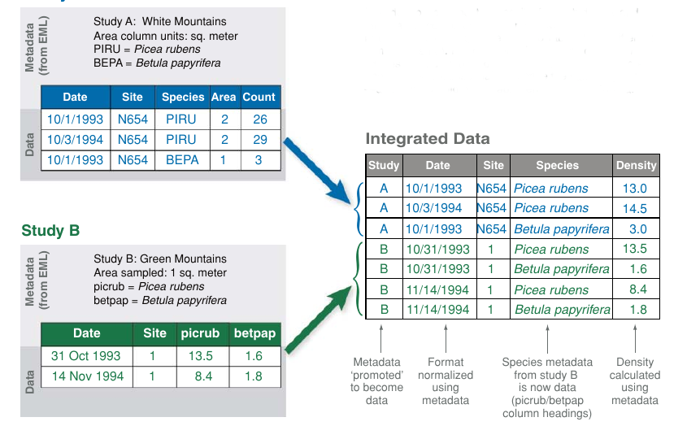

---
class: center

# Me 

--

## Assistant prof of Ecoinformatics in ESPM

--

## Theoretical Ecologist

--

## Interested in:

- Tipping points, global change ecology

--

- heterogeneous/messy data
- theory/mathematical methods
- software/computational methods

---
class: middle, center

## Data Science

---
class: middle, center

# rOpenSci

---
class: middle

# Long term time series

## Statistical issues

## Data management

---
class: center

# Changing frequency

--

consequences of going from annual sampling to every-other-year?

---
class: center

# Gaps

--

what if we had no data collection for four years?

---
class: center

# Changing sampling effort

--

fewer surveyors or fewer sites?

---
class: center

# Changing methodology

--

differing protocol, different instrumentation?

---
class: center

# Long term archiving

---
class: middle, center

# Data variety

---
background-image: url(img/factory-farm.jpg)
background-size: 100%
background-position: center
class: center, top, inverse

# Factory Farm Data...

<small>credit: Arthus-Bertrand</small>

---
background-image: url(img/organic-farm.png)
background-size: 100%
background-position: center
class: center, middle, inverse

# ... Organic, hand-crafted variety

<small>credit: Arthus-Bertrand</small>

---
class: middle, center

# Data Standards

---

# Why Data Standards?

--

- Discoverability

--

- Data Integration

--

- Data Interpretation

--

- Credit & Attribution

--

- Reproducibility

---
class: center

# Data Standards: Point Blue

[BMDE standard](https://www.birdscanada.org/resources/default/bmde2.00.pdf)

- CDAC -> AKN -> GBIF

---

# Data Standards

example: a _Darwin Core_ Occurrance record

- Interoperable, machine-readable data descriptions
- Validation, automation, quality control(?)

---
class: center, inverse

# Vertically integrated data repositories

---
background-image: url(img/gbif.png)
background-size: 100%
background-position: center
class: middle, center, inverse

# GBIF

---
class: center, inverse

# Limitations to vertical integration

---
class: middle, center

# Metadata-driven 

<small>Jones+ (2006) doi:[10.1146/annurev.ecolsys.37.091305.110031](http://doi.org/10.1146/annurev.ecolsys.37.091305.110031)</small>

---

# Metadata driven repositories

- Long Term Ecological Research (LTER) sites
- DataONE Network

---
background-image: url(img/google-dataset.png)
background-size: 100%
background-position: center

---
background-image: url(img/google-sdtt.png)
background-size: 100%
background-position: center

---
class: middle, center

# Unstructured data: the Data Lake

---
class: middle, center

# Semantic data

---
class: middle, center

# Thank you

---
class: center

# Global Change

<small> Overpeck+ (2011) doi:[10.1126/science.1197869](http://doi.org/10.1126/science.1197869) </small>

---
class: center

# Fishery Collapse?

<small> Worm+ (2006) doi:[10.1126/science.1132294](http://doi.org/10.1126/science.1132294)</small>

---
class: center

# Tipping points?

<small> Barnoksy+ (2012) doi:[10.1038/nature11018](http://doi.org/10.1038/nature11018)</small>

<!-- From linear to nonlinear thinking. Must deal with the uncertainty-->

---
class: center

# Engineering bottlenecks

<small> Baraniuk (2011) doi:[10.1126/science.1197448](http://doi.org/10.1126/science.1197448) </small>

---
class: center

# Science bottlenecks

<small>adapted from Reichman+ (2011) doi:[10.1126/science.1197962](http://doi.org/10.1126/science.1197962)</small>

---
class: center

# data visualization

Something is wrong with this picture...

<small> Fox & Hendler (2011) doi:[10.1126/science.1197654](http://doi.org/10.1126/science.1197654) </small>

